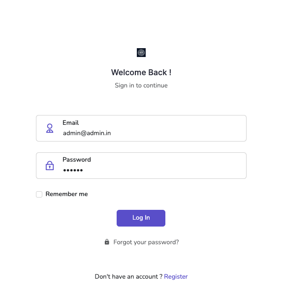
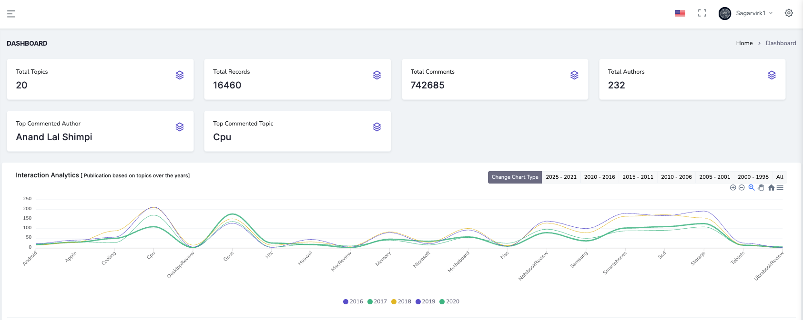
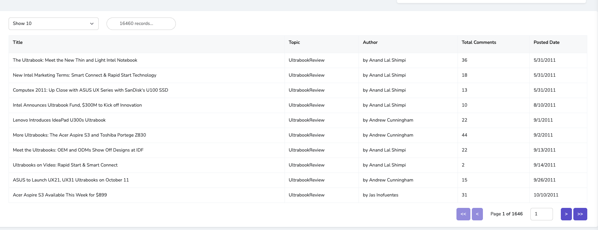
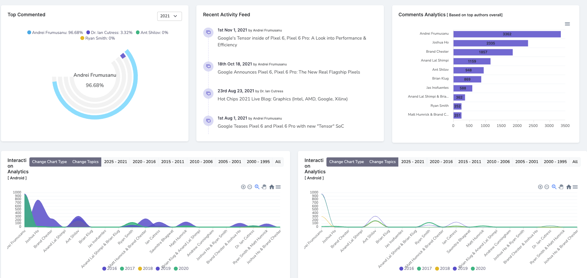
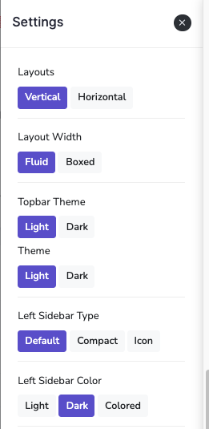

# 📊 Meta Scraper – Visualizing Blog Metadata for Better Insights

🚀 **Live Demo**: [https://web-scraping-data-visualization-react.netlify.app/login](https://web-scraping-data-visualization-react.netlify.app/login)

Meta Scraper is a full-stack web application developed as part of a Master's Thesis in Applied Computer Science at Schmalkalden University of Applied Sciences. The application is designed to automate the extraction, structuring, and visualization of metadata from blog websites. It enables users to convert raw, unstructured content into clear, interactive visual dashboards—empowering researchers, strategists, and data analysts to gain meaningful insights.

---

## 🎓 Academic Information

> **Thesis Title**: Visualize Meta Data of Blog Website  
> **Author**: Munish Sagar  
> **Degree**: M.Sc. in Applied Computer Science  
> **University**: Schmalkalden University of Applied Sciences  
> **Faculty**: Informatics

---

## 🎯 Objectives

- Extract meaningful blog metadata: titles, authors, publication dates, categories, and comment counts.
- Clean and transform unstructured data using Python and BeautifulSoup.
- Store structured JSON data in MongoDB for scalability.
- Visualize blog statistics with dynamic, customizable dashboards using React and ApexCharts.
- Enable data export in formats like CSV, PNG, and SVG.
- Explore applications of metadata analysis across broader web domains.

---

## 🧠 Application Overview

Meta Scraper offers the following features:

- 🔍 **Web Scraping**: Extracts and parses metadata from blogs using Python and BeautifulSoup.
- 📁 **Data Structuring**: Converts scraped HTML data into JSON and stores it in MongoDB.
- 📊 **Analytics Dashboard**: React-based visual dashboard displaying insights via bar, line, and donut charts.
- ⚙️ **Custom Settings**: Toggle themes (light/dark), adjust layouts, and personalize the user interface.
- 📤 **Data Export**: Download visuals and datasets in CSV, PNG, and SVG formats.
- 🔐 **Secure Authentication**: Full JWT-based registration, login, password reset, and account activation.

---

## 🛠️ Technology Stack

| Layer         | Tools & Libraries                    |
| ------------- | ------------------------------------ |
| **Frontend**  | React, Sass, React-ApexCharts, Axios |
| **Backend**   | Node.js, Express                     |
| **Database**  | MongoDB (NoSQL)                      |
| **Scraper**   | Python, BeautifulSoup                |
| **Dev Tools** | Visual Studio Code, Git, Postman     |

---

## 🔐 Authentication System

- ✅ User registration with email verification link
- 🔑 JWT-secured login and token-based session management
- 🔁 Forgot password functionality with temporary login token
- 🔁 Password reset directly from user profile
- 🛡️ Built-in error handling and feedback messages for incorrect credentials

### 🔐 Login Interface



---

## 📊 Analytics Dashboard

- 📌 Visual summaries of total authors, comments, posts, and top contributors
- 📈 Dynamic filtering by year and topic
- 📉 Charts: Line, Bar, Area, and Donut (React-ApexCharts)
- 📁 Export: Charts and data downloadable as CSV, PNG, or SVG
- 🔎 Pagination, search, and filter features integrated across views

### 📊 Dashboard Overview



### 📈 Data Visualization Charts



### 📌 Blog Metadata Metrics



---

## ⚙️ Settings Panel

- Toggle dark/light themes
- Customize layout: horizontal/vertical, boxed/fluid
- Sidebar view (compact/iconic) and color options
- Built-in responsive behavior across devices

### ⚙️ Theme and Layout Customization



---

## 🧱 Software Architecture

### 📘 System Design (C4 Model)

- **Context Diagram**: Overview of system interactions (users, scraper, database, frontend).
- **Container Diagram**: Details data flow between client, server, and MongoDB.
- **Component Diagram**: Illustrates modules like login, analytics, and charts.
- **Activity Diagrams**: Workflow diagrams for registration, login, dashboard usage, password management.

### 🔁 Data Pipeline

1. **Scrape** metadata from blog pages
2. **Parse & Transform** HTML into structured JSON
3. **Store** JSON in MongoDB
4. **Visualize** data in React dashboards
5. **Interact** via filters, themes, exports, and layout controls

---

## 📂 Functional Modules

- ✅ Registration & account activation (with verification email)
- 🔑 Login/Logout with token validation
- 🔁 Forgot password flow with email reset
- 📊 Dashboard with analytics on blog data
- 🔎 Topic-wise filters, pagination, and search
- 📥 Export visual data (CSV, PNG, SVG)
- 🎨 Complete theme and layout customization

---

## 📈 Key Use Cases

- 📌 **Analyze Blog Trends**: Measure engagement over time through post and comment activity.
- 🧠 **Identify Top Contributors**: See who publishes and receives the most interaction.
- 🔍 **Track Author Activity**: Monitor frequent bloggers and their performance.
- 🎯 **Visual Insights**: Turn metadata into visual stories for content strategy.

---

## 📦 Installation & Setup

### Prerequisites

- Node.js
- MongoDB
- Python 3.x
- pip (`pip install beautifulsoup4`)

### Steps

```bash
# Clone the project
git clone https://github.com/yourusername/meta-scraper.git
cd meta-scraper

# Install backend dependencies
npm install

# Start the backend server
npm run server

# Open another terminal for frontend
npm start
```
